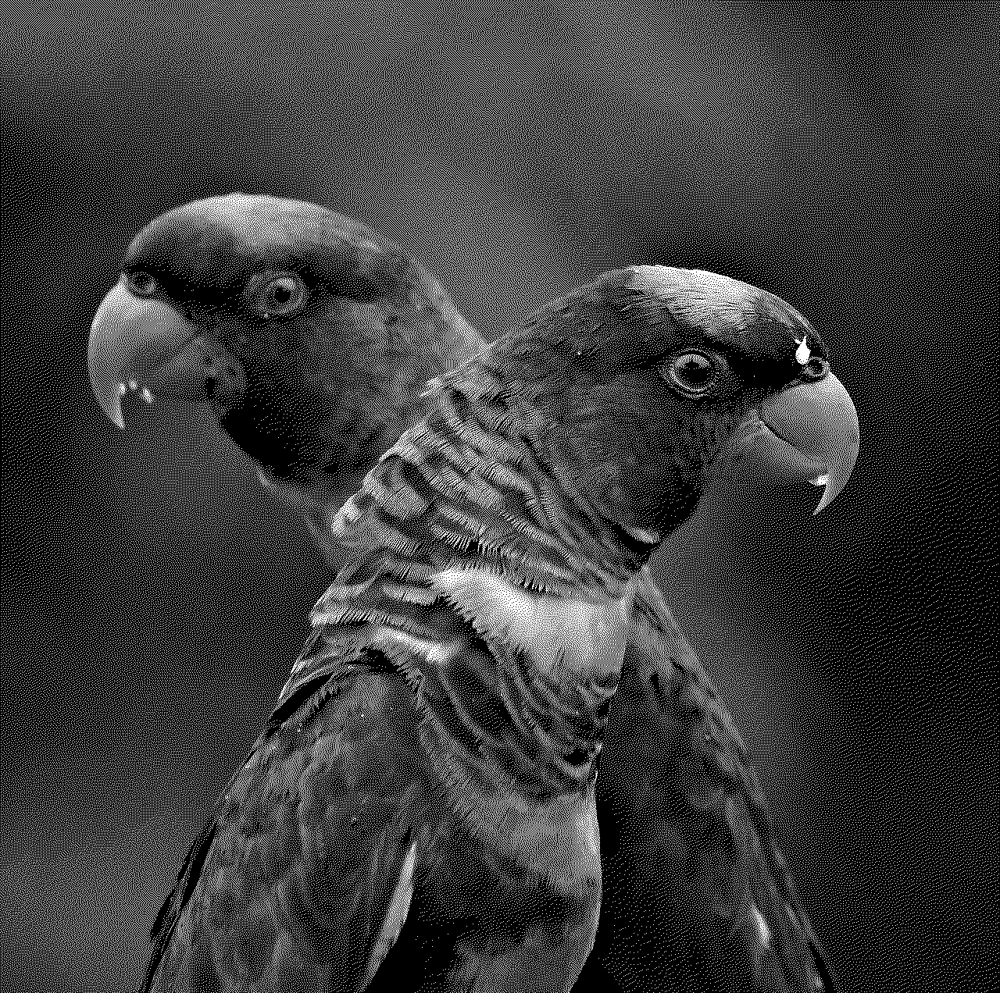

# Dither

## Wasm

Following will create js, ts and wasm in the pkg folder (then the wasm example just works)
```
wasm-pack build --release --target web --features web
```

## Run as cli

Following will convert `image.png` to `image_output.png`
```
cargo run -r -- -i image.png -a sierra 
```

## Preview
<table>
  <tr>
    <td></td>
    <td></td>
  </tr>
  <tr>
    <td style="text-align: center;">Original</td>
    <td style="text-align: center;">Floyd-Steinberg</td>
  </tr>
</table>
